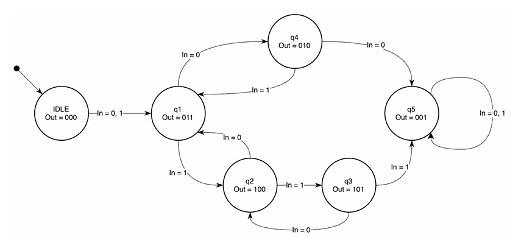

# Problem 1: Moore Finite State Machine (FSM)  

## 1. วิเคราะห์โจทย์

โจทย์กำหนดให้สร้าง **Moore FSM** ที่มีคุณสมบัติดังนี้

- เริ่มต้นทำงานที่สถานะ **IDLE**
- มีอินพุต 1 บิต (`in`) ใช้ควบคุมการเปลี่ยนสถานะ
- ใช้ **synchronous reset (active-high)**  
  เมื่อ `rst = 1` FSM จะกลับไปที่สถานะเริ่มต้น
- เอาต์พุตเป็นสัญญาณขนาด **3 บิต (`out`)**
- เอาต์พุตขึ้นอยู่กับ **สถานะปัจจุบันเท่านั้น** (ตามนิยามของ Moore FSM)

จาก state diagram ที่กำหนด
- FSM มีทั้งหมด **6 สถานะ**
- การเปลี่ยนสถานะ (state transition) ถูกกำหนดจากค่า `in`
- บางสถานะมีการวนซ้ำกลับมาที่ตัวเอง (self-loop)

แนวทางการออกแบบที่เหมาะสมคือ
- ใช้ **state register** สำหรับเก็บสถานะปัจจุบัน
- ใช้ **next-state logic** แบบ combinational เพื่อกำหนดสถานะถัดไป
- กำหนดเอาต์พุตจากค่าของสถานะโดยตรง



---

## 2. อธิบายโค้ด

### 2.1 การประกาศ Module และพอร์ต

```verilog
module moore_fsm (
    input        clk,
    input        rst,
    input        in,
    output [2:0] out
);
```

* `clk` : สัญญาณนาฬิกา
* `rst` : synchronous reset (active-high)
* `in` : อินพุต 1 บิตสำหรับกำหนดการเปลี่ยนสถานะ
* `out` : เอาต์พุต 3 บิต

### 2.2 การกำหนดสถานะ (State Encoding)

```verilog
localparam S0 = 3'b000,
           S1 = 3'b011,
           S2 = 3'b100,
           S3 = 3'b101,
           S4 = 3'b010,
           S5 = 3'b001;
```

* FSM มีทั้งหมด 6 สถานะ
* ใช้ `localparam` เพื่อให้อ่านง่ายและแก้ไขสะดวก
* ค่าของสถานะจะถูกใช้เป็นค่าเอาต์พุตโดยตรง

### 2.3 ตัวแปรสถานะ

```verilog
reg [2:0] state, next_state;
```

* `state` : เก็บสถานะปัจจุบัน
* `next_state` : เก็บสถานะถัดไปที่จะเปลี่ยนใน clock ถัดไป

### 2.4 State Register (Sequential Logic)

```verilog
always @(posedge clk) begin
    if (rst)
        state <= S0;
    else
        state <= next_state;
end
```

* ทำงานที่ขอบขาขึ้นของสัญญาณนาฬิกา
* เมื่อ `rst = 1` จะรีเซต FSM กลับไปที่ `S0`
* เมื่อ `rst = 0` จะอัปเดตสถานะเป็น `next_state`
* เป็นการรีเซตแบบ synchronous

### 2.5 Next-State Logic (Combinational Logic)

```verilog
always @(*) begin
    case (state)
        S0: next_state = S1;
        S1: next_state = (in ? S2 : S4);
        S2: next_state = (in ? S3 : S1);
        S3: next_state = (in ? S5 : S2);
        S4: next_state = (in ? S1 : S5);
        S5: next_state = S5;
        default: next_state = S0;
    endcase
end
```

* ใช้ `always @(*)` เพื่อให้เป็น combinational logic
* การเปลี่ยนสถานะขึ้นอยู่กับ
  * สถานะปัจจุบัน (`state`)
  * ค่าอินพุต (`in`)
* สถานะ S5 เป็นสถานะค้าง (self-loop)

### 2.6 Output Logic (Moore FSM)

```verilog
assign out = state;
```

* เป็นลักษณะของ Moore FSM
* เอาต์พุตขึ้นอยู่กับสถานะปัจจุบันเท่านั้น
* ทำให้โค้ดเรียบง่ายและตรงตามนิยาม