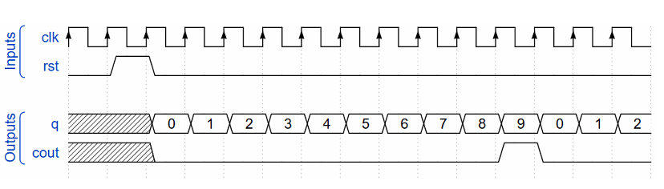

# Problem 2: BCD Counter

## 1. วิเคราะห์โจทย์

โจทย์นี้ให้เราออกแบบ **BCD Counter (Binary-Coded Decimal Counter)**  
ซึ่งเป็นตัวนับเลขฐานสิบในรูปแบบไบนารี โดยมีรายละเอียดดังนี้

### คุณสมบัติของ BCD Counter
- นับค่าตั้งแต่ **0 ถึง 9**
- เมื่อถึงค่า **9** แล้ว จะกลับไปนับที่ **0** ใหม่
- ทำงานแบบ **synchronous** คืออัปเดตค่าที่ขอบขาขึ้นของสัญญาณนาฬิกา (`posedge clk`)
- มีสัญญาณ **reset แบบ synchronous และ active-high**
  - เมื่อ `rst = 1` จะรีเซ็ตค่าทุกเอาต์พุตเป็น 0
- มีเอาต์พุต `cout` เป็น **pulse 1 clock** เพื่อบอกว่า
  - การนับครบหนึ่งรอบ (ถึง 9) แล้ว

### สัญญาณอินพุต
- `clk` : สัญญาณนาฬิกา ใช้ควบคุมการนับ
- `rst` : สัญญาณรีเซ็ตแบบ synchronous (active high)

### สัญญาณเอาต์พุต
- `q` : เอาต์พุตขนาด 4 บิต แทนค่าปัจจุบันของตัวนับ (0–9)
- `cout` : เอาต์พุต 1 บิต เป็น pulse เมื่อการนับครบหนึ่งรอบ

### พฤติกรรมที่ต้องการ
- ถ้า `rst = 1` → `q = 0`, `cout = 0`
- ถ้า `q = 8` → นับเป็น `9` และ `cout = 1`
- ถ้า `q = 9` → กลับไป `0` และ `cout = 0`
- ค่าอื่น ๆ → นับเพิ่มทีละ 1 และ `cout = 0`



---

## 2. อธิบายโค้ด

```verilog
module bcd_counter ( 
    input        clk,
    input        rst,
    output reg [3:0] q,
    output reg      cout
);
```

**การประกาศโมดูล**

* `q` เป็น `reg [3:0]` เพราะต้องเก็บค่าการนับ 0–9
* `cout` เป็น `reg` เพื่อเก็บค่า pulse ที่เกิดขึ้นชั่วคราว

```verilog
always @(posedge clk) begin
```

* ใช้ `always @(posedge clk)` เพื่อให้เป็น synchronous circuit
* การเปลี่ยนค่าจะเกิดขึ้นเฉพาะที่ขอบขาขึ้นของ clock เท่านั้น

```verilog
if (rst) begin
  q    <= 4'd0;
  cout <= 1'b0;
end

```

**ส่วน Reset**
* เมื่อ `rst` เป็น 1
  * รีเซ็ตค่าการนับ `q` เป็น 0
  * รีเซ็ต `cout` เป็น 0
* เป็น **synchronous reset** เพราะอยู่ใน `posedge clk`

```verilog
else begin
  if (q == 4'd9) begin
    q    <= 4'd0;
    cout <= 1'b0;
```

**กรณี q = 9**
* แสดงว่าการนับครบแล้ว
* รีเซ็ตตัวนับกลับไปที่ 0
* `cout` เป็น 0 เพราะ pulse ได้ถูกส่งไปก่อนหน้านี้แล้ว

```verilog
  end else if (q == 4'd8) begin
    q    <= 4'd9;
    cout <= 1'b1;
```

**กรณี q = 8**
* เมื่อนับจาก 8 ไปเป็น 9
* สร้าง pulse โดยตั้งค่า `cout = 1`
* ใช้เพื่อบอกว่า **กำลังจะครบหนึ่งรอบการนับ**

```verilog
  end else begin
    q    <= q + 4'd1;
    cout <= 1'b0;
  end
end
```

**กรณีทั่วไป**
* เพิ่มค่าการนับทีละ 1
* `cout` เป็น 0 เพราะยังไม่ครบหนึ่งรอบ

**สรุปการทำงาน**
* ตัวนับจะนับจาก 0 → 9 วนซ้ำไปเรื่อย ๆ
* `cout` จะเป็น 1 เพียง 1 clock เมื่อค่ากำลังเปลี่ยนจาก 8 → 9