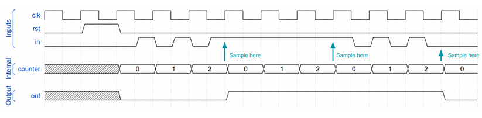

# Problem 3: Debouncer Module

## Objective
โจทย์ข้อนี้มีวัตถุประสงค์เพื่อให้เข้าใจแนวคิดของ **signal debouncing** โดยใช้วิธีการ **sampling ตามคาบเวลา (clock cycles)** และนำไปสู่การเขียนโมดูล Verilog ที่สามารถกำหนดพารามิเตอร์ได้ (parameterized module)

Debouncer จะช่วยลดปัญหาสัญญาณกระตุก (bounce) ที่มักเกิดจากปุ่มกดหรือสัญญาณอินพุตทางกายภาพ โดยจะอัปเดตค่าเอาต์พุตเฉพาะช่วงเวลาที่กำหนดเท่านั้น

---

## 1. วิเคราะห์โจทย์

### แนวคิดหลัก
- สัญญาณ `data_in` อาจมีการเปลี่ยนค่าอย่างรวดเร็ว (bounce)
- เราจะ **ไม่อัปเดตค่า output ทุก clock**
- แต่จะ **sample สัญญาณทุก ๆ `SAMPLING_RATE` clock cycles**
- เมื่อถึงรอบ sampling จึงนำค่า `data_in` ไปอัปเดตที่ `data_out`

### เงื่อนไขสำคัญ
- ใช้ **synchronous reset (active-high)**
- เมื่อ `rst = 1`
  - รีเซ็ต `data_out` เป็น 0
  - รีเซ็ต counter ภายในเป็น 0
- โมดูลต้องรองรับการตั้งค่า parameter

### Inputs
- `clk` : สัญญาณ clock
- `rst` : synchronous reset (active high)
- `data_in` : สัญญาณอินพุตที่ต้องการ debounce

### Outputs
- `data_out` : สัญญาณเอาต์พุตหลังจาก debounce แล้ว

### Parameters
- `SAMPLING_RATE`
  - จำนวน clock cycle ต่อการ sample หนึ่งครั้ง
  - ค่า default = 3
- `COUNTER_WIDTH`
  - ความกว้างของ counter
  - ค่า default = 2 (นับได้ 0–3)



---

## 2. อธิบายโค้ด

```verilog
module debouncer #(
    parameter SAMPLING_RATE = 3,
    parameter COUNTER_WIDTH = 2
) (
    input clk,
    input rst,
    input data_in,
    output reg data_out
);
```

* สร้างโมดูล `debouncer`
* ใช้ parameter เพื่อให้ปรับ sampling rate และขนาด counter ได้
* `data_out` เป็น `reg` เพราะถูกกำหนดค่าใน always block

```verilog
  reg [COUNTER_WIDTH-1:0] c;
```

* `c` เป็น counter ภายใน
* ใช้นับจำนวน clock cycle
* ขนาดของ counter ถูกกำหนดด้วย `COUNTER_WIDTH`

```verilog
  always @(posedge clk) begin
```

* ใช้ **positive edge triggered** always block
* เป็น synchronous logic ทั้งหมด

```verilog
    if (rst) begin
      c        <= 0;
      data_out <= 0;
    end
```

* เมื่อ `rst = 1`
  * รีเซ็ต counter เป็น 0
  * รีเซ็ต output เป็น 0
* เป็น synchronous reset เพราะตรวจสอบใน `posedge clk`

```verilog
    else begin
      if (c == SAMPLING_RATE - 1) begin
```

* ตรวจสอบว่า counter นับครบจำนวน sampling rate หรือยัง
* ใช้ `SAMPLING_RATE - 1` เพราะ counter เริ่มนับจาก 0

```verilog
        data_out <= data_in;
        c        <= 0;
```

* เมื่อถึงรอบ sampling:
  * นำค่า `data_in` ปัจจุบันไปอัปเดตที่ `data_out`
  * รีเซ็ต counter เพื่อเริ่มรอบใหม่

```verilog
      end else begin
        c <= c + 1;
      end
```

* ถ้ายังไม่ถึงรอบ sampling
  * เพิ่มค่า counter ไปเรื่อย ๆ

**สรุป**
* โมดูลนี้ใช้ counter เพื่อนับ clock cycle
* Sample ค่า `data_in` เป็นช่วง ๆ เพื่อลดผลกระทบจาก bounce
* ใช้ synchronous reset เพื่อควบคุมสถานะเริ่มต้นอย่างชัดเจน
* สามารถปรับพฤติกรรมของ debouncer ได้ง่ายผ่าน parameter
